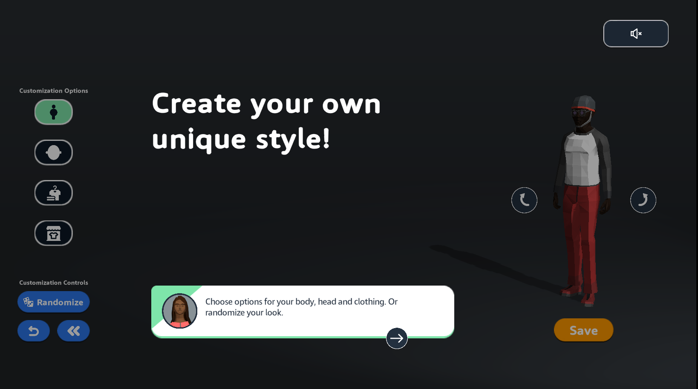
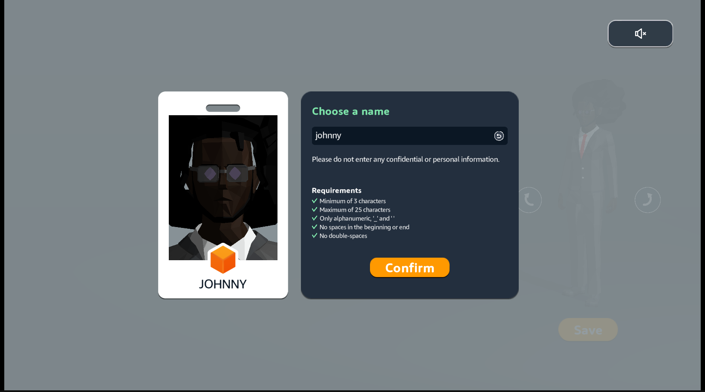
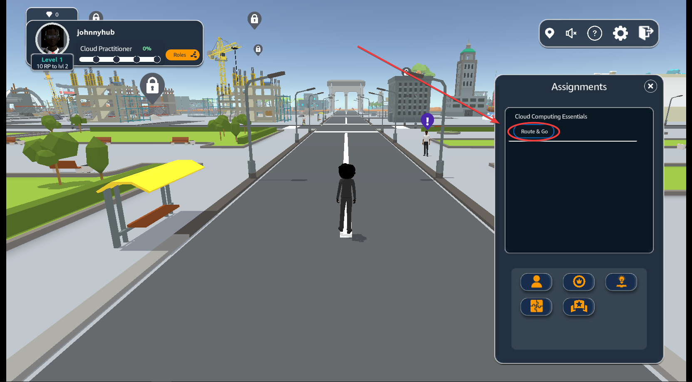
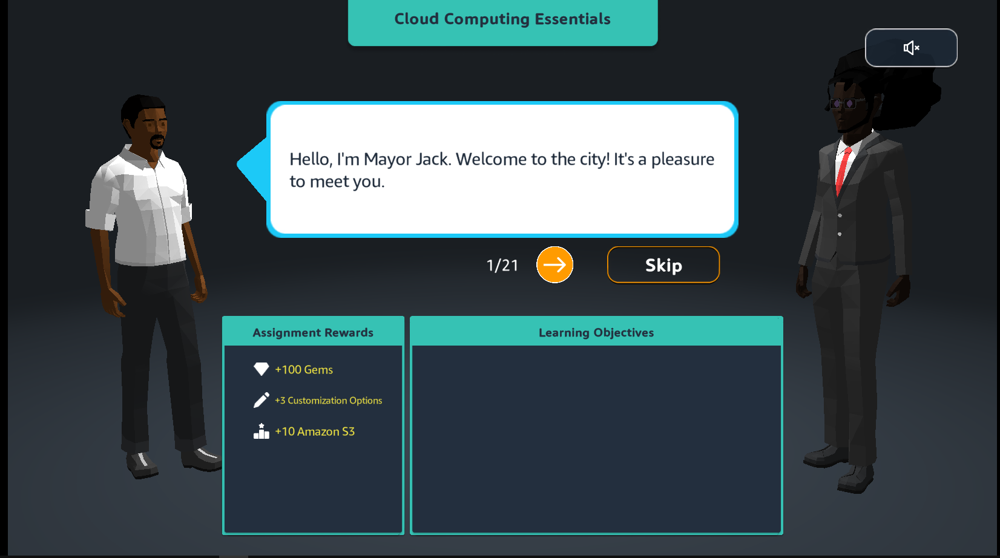
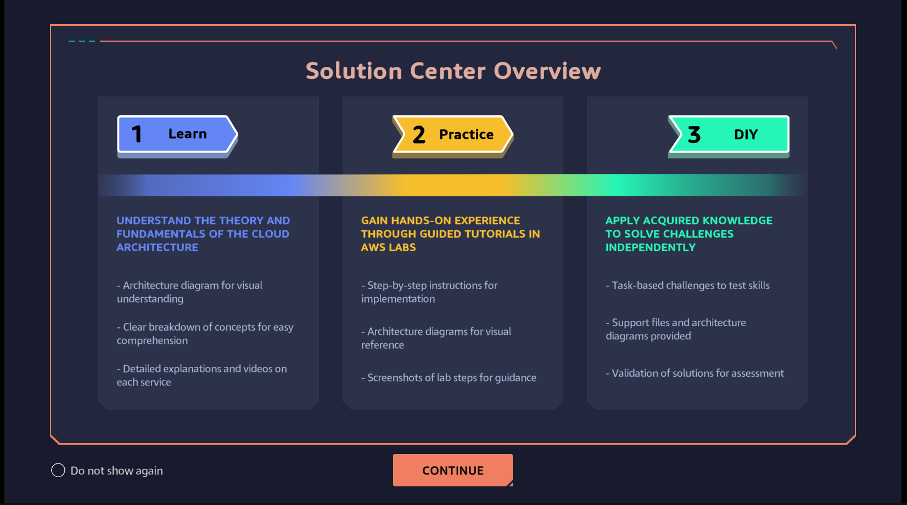

After logging in, the AWS Training and Certification interface appears with the https://skillbuilder.aws/learn/FU5WCYVGKY/aws-cloud-quest-cloud-practitioner/JF9TKU68GT.

The course will be this:

The start of the game appears:

Create your avatar:

Enter your name:

Select **ASSIGNMENT**
In Cloud Computing Essentials, select ROUTE AND GO

Select the ! icon to go to the next step

In the preparation interface

    - View Rewards
    - See Solution Annotations
    - Select ACCEPT
